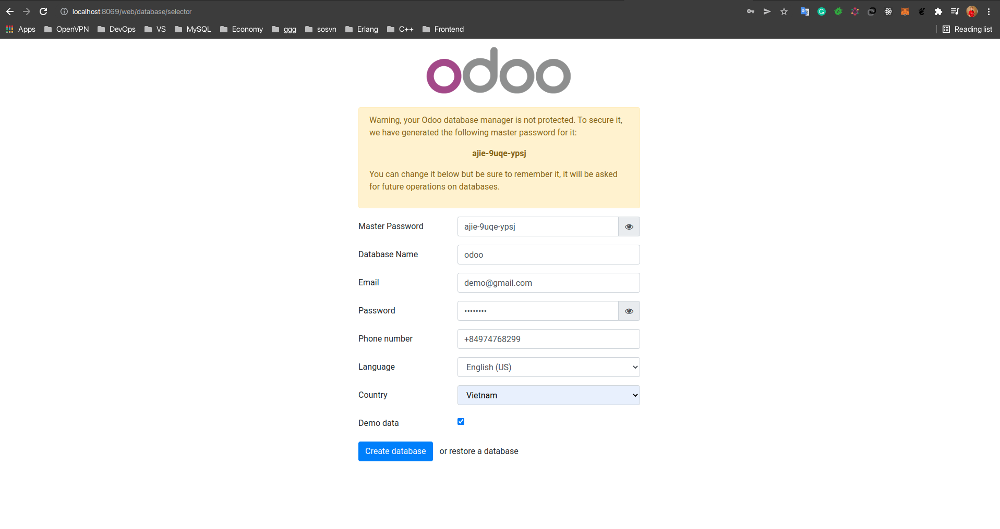
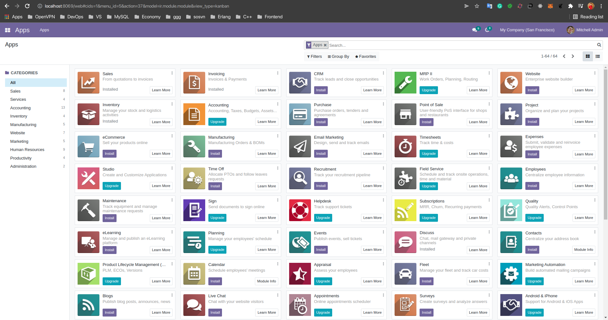

# Odoo 16

The repository support run odoo 16 in docker on ADM/ARM architecture

## How to run?

```bash

git clone https://github.com/dylanops/docker-odoo.git

cd docker-odoo

cp .env.sample .env

docker-compose up -d

docker exec -ti --user root odoo chown -R odoo:odoo /mnt/extra-addons/ var/lib/odoo/

```

## Install odoo

* Go to [http://localhost:8069/](http://localhost:8069/)
* Database Name: odoo





## How to create custom module?

```bash
docker exec -ti odoo odoo scaffold /mnt/extra-addons/custom_module
```

## Build docker with multi architecture

```bash
cd docker/16

docker buildx build --push --platform linux/amd64,linux/arm64/v8 . --tag dylanops/odoo:16
```
