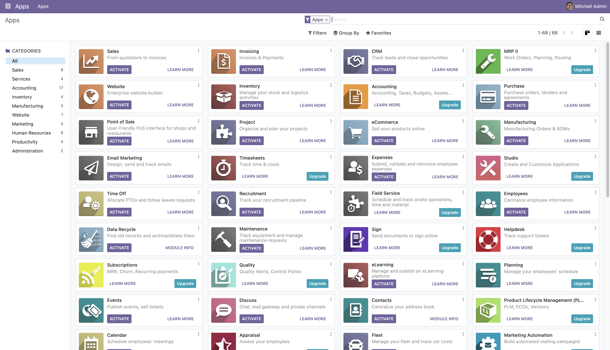

# Docker compose for Odoo 17

The repository support run odoo 17 in docker on Linux/Mac OSX M1 M2 architecture

## How to run?

```bash

git clone https://github.com/dylanops/docker-odoo.git

cd docker-odoo

cp .env.sample .env

docker-compose up -d

docker exec -ti --user root odoo chown -R odoo:odoo /mnt/extra-addons/ var/lib/odoo/

```

## Install odoo

* Go to [http://localhost:8069/](http://localhost:8069/)
* Database Name: odoo




## How to create custom module?

```bash
Open the file:

/etc/odoo/odoo.conf

Add lines:

addons_path = /mnt/extra-addons
data_dir = /var/lib/odoo

Then create a new module:

docker exec -ti odoo odoo scaffold /mnt/extra-addons/custom_module
```
